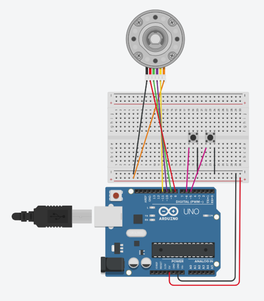
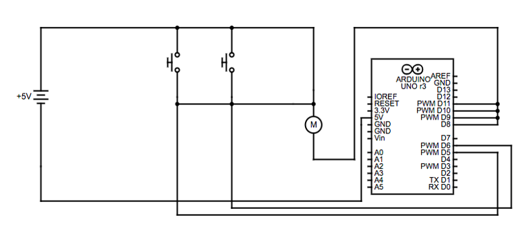

# Stepper Motor Controller

Two-button stepper motor direction controller for Arduino (ATmega328).  

Built as part of a 2019 GCSE Design & Technology project.

**_Uploaded by request from the comments on [this video](https://www.youtube.com/shorts/_QWHReOaG14)._**

## Hardware

- **Board:** Orangepip Kona328 (ATmega328-based, Arduino Uno compatible)
- **Motor:** 28BYJ-48 stepper motor (or equivalent, 2038 steps/revolution)
- x2 push buttons and breadboard (if prototyping before using Arduino only)

## Wiring

| Component | Pin |
|-----------|-----|
| Stepper coil A | D8 |
| Stepper coil B | D10 |
| Stepper coil C | D9 |
| Stepper coil D | D11 |
| Button 1 (CW) | D5 |
| Button 2 (ACW) | D6 |

  
Buttons are wired with INPUT_PULLUP - connect one leg to the pin, other leg to GND.

## Prototyping With Breadboard

## Circuit Schematic

## Dependencies

- Built-in Arduino Stepper library (no install needed)

## Usage

1. Open `stepper_control/stepper_control.ino` in Arduino IDE
2. Select board: Arduino Uno (Kona328 is Uno-compatible)
3. Upload and press either button to rotate clockwise/anticlockwise
